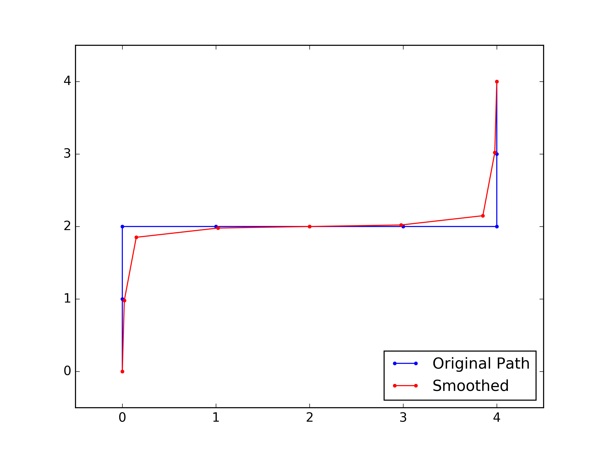

# Introduction
This repository contains all the homework coding projects from the Udacity class *Artificial Intelligence for Robotics -- Programming a Robotic Car*. Instructor for this class is Sebastian Thrun, a pioneer of autonomous driving and the previous leader of Google self-driving program. Sebastian gives a broad overview of the core subjects related to Robotics, including **Localization, Tracking, Motion planning, PID control and SLAM**. 

I finished all the coding assignments for the 6 units of this class. Sebastian's instruction is very clear so it is not difficult to finish the projects after understanding his lecture. All of my codes passed the online grader. I also made improvements to some of the algorithms. For example, the motion planning is related to a generic subject about search and planning. I have tried to write the code into a more standardized structure and used some more efficient algorithms, e.g. Dijkstra minimum path for the deterministic dynamic programming (Yes, I know Dijkstra is greedy not DP.). 

I learned a lot about Robotics from Sebastian's class, especially about some key theories. And it also won't take long to finish this class, if you are really focused. It took me one week but I haven't finished the final project of "chasing the escaping car" yet. (Definitely on my TODO list....)

Below is a summary of the codes in this repository, which are all the coding assignments for the class. Codes are all written in Python 3. (The original class codes are in Python 2)

1. file name note
2. PID figure
3. Search result
4. SLAM result

# Localization and tracking, Unit 1, 2, 3
> Unit 1, 2, 3 are all about the Robot localization and tracking, using different filters, including **Histogram filter, Kalman filter and Particle filter**

Localization is nothing but an iteration of sensing and motion. Sensing is reducing the uncertainty of Robot location by observing the environment. Moving is increase the uncertainty of Robot next location, because motion has uncertainty. 

Sensing is based on Bayes rule, Moving is based on total probability. In practice, for different filters:
**Sensing**:
1. Histogram filter: multiply likelihood (measurement) and a prior distribution of the location. 
2. Kalman filter: multiply two Gaussian distribution (measurement and a prior location distribution)
3. Particle filter: Resampling all the particles based on their weights.

**Motion**
1. Histogram filter: Convolution of location probability with motion probability.
2. Kalman filter: Add two Gaussian distribution (Location distribution and motion distribution)
3. Particle filter: Move all the particles use the robot motion with randomness (motion uncertainty).

Tracking is to obtain estimation of both Robot location and velocity. Kalman filter can do this nicely. 

## Unit 1, Histogram filter

Histogram filter is also called Discrete filter. 
```bash 
## simple 1D localization using Histogram filter
DiscreteFilter_1D.py
## simple 2D localization using Histogram filter
DiscreteFilter_2D.py
```

Example output:
``` 
## 5 locations (1D case)
Estimated probability at each location:
[0.07882352941176471, 0.07529411764705884, 0.22470588235294123, 0.4329411764705882, 0.18823529411764706]
```

## Unit 2, Kalman filter
```bash 
## simple 1D localization using Kalman filter
KalmanFilter_locOnly.py
```

Example output:
``` 
## 1D, give mu and Var of Gaussian distribution
Estimated location with uncertainty:
[10.999906177177365, 4.005861580844194]
```

```bash 
## 1D tracking of location and velocity
KalmanFilter_tracking_1D.py
## 2D tracking of location and velocity
KalmanFilter_tracking_2D.py
```

Example output 2D tracking:
```
### 4-dimensional example (x, y, x velocity, y velocity) ###
x (Location and Velocity): 
x= 
[9.999340731787717]
[0.001318536424568617]
[9.998901219646193]
[-19.997802439292386]
 
P (Covariance Matrix): 
P= 
[0.03955609273706198, 0.0, 0.06592682122843721, 0.0]
[0.0, 0.03955609273706198, 0.0, 0.06592682122843721]
[0.06592682122843718, 0.0, 0.10987803538073201, 0.0]
[0.0, 0.06592682122843718, 0.0, 0.10987803538073201]
```

## Unit 3, Particle filter
```bash 
##  2D particle filter for a dumb Robot localization
Particle_dumbRobot.py
## Car robot using bicycle model, Particle filter localization
Particle_carRobot.py
```

Example output for estimation of Car robot location:
```
Estimated Car status (x, y, orientation):
[97.22807835944093, 60.91998895002554, 5.26857779305778]
```

# Search and Planning, Unit 4

For BFS, DFS, Uniform cost search, A* search, there is standard structure (pseudo code):
```python
Explored = empty
frontier = container
frontier.push(root)

while frontier is not empty:
    Node=frontier.pop()
    if Node not in Explored:
        visit(Node)
        If Node is goal: 
            Success!
        Explored.add(Node)

        for child_node in child(Node):
            if child_node not in Explored:
            frontier.push(child_node)
Failed! 
```
The only difference is that BFS use Queue, DFS use Stack, Uniform cost and A* search use PriorityQueue as the container. 

```bash 
## BFS search use Queue for frontier container
Maze_BFS.py
## BFS search, print expand sequence
Maze_Expand.py
## BFS search, print path. After find the goal, track the path backward. 
Maze_BFS_printPath.py
## A* search, use Manhattan distance as heuristic. PriorityQueue as container.
Maze_Astar.py
```

Use search methods, when find the Path, need to go backwards to track from goal to initial location. 

Example output of path using BFS:
```
Path:
['v', ' ', ' ', ' ', ' ', ' ']
['>', '>', '>', '>', '>', 'v']
[' ', ' ', ' ', ' ', ' ', 'v']
[' ', ' ', ' ', ' ', ' ', 'v']
[' ', ' ', ' ', ' ', ' ', '*']
Grid:
[0, 0, 1, 0, 0, 0]
[0, 0, 0, 0, 0, 0]
[0, 0, 1, 0, 1, 0]
[0, 0, 1, 0, 1, 0]
[0, 0, 1, 0, 1, 0]
```

```bash 
## Dijkstra, print value
DynamicProgramming_value.py
## Dijkstra, print policy. Reversely set the motion. 
DynamicProgramming_policy.py
## Forward Dynamic Programming, Deterministic. 
DynamicProgramming_policy_method2.py
## Forward Dynamic Programming, Stochastic.
DynamicProgramming_stochastic.py
```

`DP_value` and `DP_policy` are implemented using Dijkstra method. Basically, it start from goal to all other locations. When print the path, we also need to track backward. 

`DP_policy_method2` and `DP_stochastic` are using Dynamic programming by doing iteration until no changes to the value matrix. For stochastic movements, only Dynamic programming works. 

Example output (DP stochastic, high penalty for hitting obstacles):
```
Value:
[471.93, 274.85, 161.55, 0]
[334.05, 230.95, 183.69, 176.69]
[398.35, 277.58, 246.09, 335.39]
[700.17, 1000, 1000, 668.69]
Policy:
['>', 'v', 'v', '*']
['>', '>', '^', '<']
['>', '^', '^', '<']
['^', ' ', ' ', '^']
Grid:
[0, 0, 0, 0]
[0, 0, 0, 0]
[0, 0, 0, 0]
[0, 1, 1, 0]
```


```bash 
## Car Robot, Dynamic programming. 
Car_leftTurn_DP.py
## Car Robot, A* search.
Car_leftTurn_Astar.py
```
In this example, Car status is 3D (x, y, orientation). Thus the value matrix and policy matrix also need to be 3D. The final policy of the path is 2D, which should be extract from the 3D policy. Again, A* search only work for deterministic case. 

Example output:
```
Policy:
[' ', ' ', ' ', 'R', '#', 'R']
[' ', ' ', ' ', '#', ' ', '#']
['*', '#', '#', '#', '#', 'R']
[' ', ' ', ' ', '#', ' ', ' ']
[' ', ' ', ' ', '#', ' ', ' ']
Value:
[999, 999, 999, 12, 10, 9]
[999, 999, 999, 13, 999, 7]
[0, 1, 2, 3, 4, 6]
[999, 999, 999, 15, 999, 999]
[999, 999, 999, 16, 999, 999]
Grid:
[1, 1, 1, 0, 0, 0]
[1, 1, 1, 0, 1, 0]
[0, 0, 0, 0, 0, 0]
[1, 1, 1, 0, 1, 1]
[1, 1, 1, 0, 1, 1]
```


# PID Control, Unit 5
## Path smoothing
In discrete world, the path from planning is not smooth. But Robot prefer a smoothed path. This can be done by smoothing:
```bash 
## Smooth path
Path_smoothing.py
## Smoothing cyclic path
Path_cyclicSmoothing.py
## Smoothing cyclic path with extra constraints.
Path_fixedSmoothing.py
```

<center>
<figure>
  <p>
  <p>Figure - Smoothed path vs original path. Fixed point of first and last points. 
</figure>
</center>

<center>
<figure>
  <p>
  <p>Figure - Smoothing for cyclic path. 
</figure>
</center>

<center>
<figure>
  <p>
  <p>Figure - Smoothing for cyclic path. Fixed points at the edges. The smoothing method is different from the previous two. 
</figure>
</center>


## PID
After having a smoothed path to go, we need to control the Robot to move as wanted. PID control is nothing but:
1. Proportional: to minimize the error (current location to desired location)
2. Derivative: Smooth path (minimize derivative)
3. Integral: Fix bias (what if your steering wheel is not pointing correctly?)

```bash
## Understand P, D, I control 
PID_control.py
## Find best PID control parameters by twiddle
PID_twiddle_parameter.py
## PID control for path like Racetrack.
PID_Racetrack.py
```

<center>
<figure>
  <p>
  <p>Figure - P, D, I controls compared.  
</figure>
</center>

<center>
<figure>
  <p>
  <p>Figure - Twiddle the best parameter for PID control. 
</figure>
</center>

# SLAM, Unit 6
## Car Robot in Maze
Putting everything learned in previous Units together. Simulate a Car Robot in maze. First plan a smoothed shortest path. Then during Robot movement, localize
use Particle filter and move use PID control.
```bash 
## Everything together. Car Robot in Maze.
RoboticCar.py
```

<center>
<figure>
  <p>
  <p>Figure - Amazing Robot running in a Maze! 1. find the way out, 2. Smooth the path, 3. Go! localing itself use particle filter and PID control for move.
</figure>
</center>

## SLAM
I learned:
1. GraphSLAM, a simple SLAM algorithm.
2. Online SLAM, save space by only keeping the most recent movement. Of course every time previous robot locations are discarded, the matrix should be updated.

SLAM is Simultaneously Localization and Mapping. It builds a matrix $\Omega$ and vector $\xi$, which contains all the constraints from robot subsequent motions and observations on Landmarks. Finally, the location of robot and landmarks are obtained by $\Omega ^{-1} \xi$.

```bash 
## Simple SLAM, Omega and xi matrix are hard-coded
simple_SLAM.py
## SLAM for Robot, Omega and xi is obtained from Robot Sense and Move. 
Robot_SLAM.py
## Online SLAM for Robot
Online_SLAM.py
```

Example output from Robot SLAM:
```
Landmarks:  [[52, 97], [38, 57], [5, 14], [100, 72], [71, 88]]
Robot: [x=56.96776 y=50.86225]

Estimated Pose(s):
    [49.999, 49.998]
    [69.128, 55.520]
    [86.708, 61.002]
    [70.132, 50.470]
    [53.692, 40.638]
    [38.165, 30.260]
    [22.290, 20.776]
    [6.220, 10.256]
    [27.258, 8.963]
    [47.693, 6.837]
    [68.127, 4.710]
    [51.929, 15.354]
    [35.947, 25.730]
    [19.782, 36.525]
    [3.805, 49.247]
    [6.734, 69.972]
    [11.135, 89.490]
    [26.403, 76.258]
    [41.125, 63.284]
    [56.160, 50.095]

Estimated Landmarks:
    [50.746, 97.954]
    [38.829, 58.557]
    [5.272, 15.406]
    [101.154, 72.513]
    [69.147, 89.230]
```

Example output from Online SLAM:
```
From online SLAM:
Estimated Pose(s):
    [81.635, 27.175]
Estimated Landmarks:
    [98.097, 14.556]
    [71.979, 75.076]
    [65.304, 22.151]

From SLAM
Estimated Pose(s):
    [50.000, 50.000]
    [66.033, 39.123]
    [82.231, 27.262]
    [98.302, 16.120]
    [81.635, 27.175]
Estimated Landmarks:
    [98.097, 14.556]
    [71.979, 75.076]
    [65.304, 22.151]
```

# Final Project, Chase the escaping robot
Not done yet...